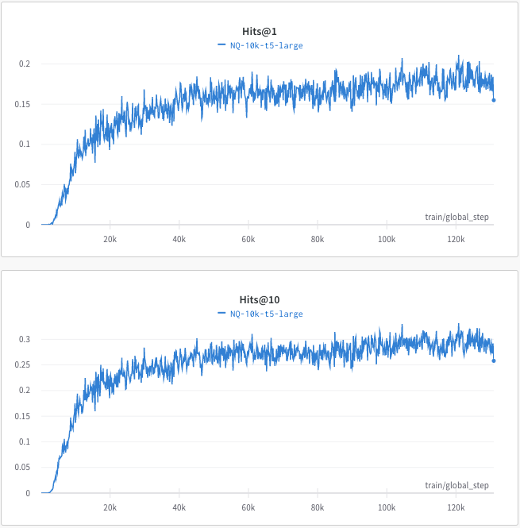

# DSI-transformers
A huggingface transformers implementation of [Transformer Memory as a Differentiable Search Index](https://arxiv.org/abs/2202.06991), Yi Tay, Vinh Q. Tran, Mostafa Dehghani, Jianmo Ni, Dara Bahri, Harsh Mehta, Zhen Qin, Kai Hui, Zhe Zhao, Jai Gupta, Tal Schuster, William W. Cohen, Donald Metzler

Requirements: `python=3.8` `transformers=4.17.0` `datasets=1.18.3` `wandb`
> Note: This is not the official repository.

## Updates
- Check out our new repository for DSI training: https://github.com/ArvinZhuang/DSI-QG

## Goal of this repository
Reproduce the results of DSI Large, Naive String Docid, NQ10K. According to Table 3 in the original paper, we should have `Hits@1=0.347`,`Hits@10=0.605`

### Step1: Create NQ10K training (indexing) and validation datasets

```
cd data/NQ
python3 create_NQ_train_vali.py
```

### Step2: Run training script
cd back to the root directory and run:

```
python3 train.py
```
The training can be run with a single Tesla-v100 32G GPU. We use [wandb](https://wandb.ai/site) to log the Hits scores during training:




### Discussion

As the above plots show, the current implementation is worse than what is reported in the original paper, there are many possible reasons: the ratio of training and indexing examples (we use 1:1), number of training steps, the way of constructing documents text, etc. Although, seems the scores are on par with BM25 already.

If you can identify the reason or any bug, welcome to open a PR to fix it!

#### Indexing or overfitting?
The training script also logged the hit@1 scores on the training set during training, this is aimed to analyze if the model can memorize all the training data points, the authors called this 'indexing' which I believe is just letting the model overfits the training data points. It turns out the model can reach %99.99 hit@1 on the training set very quickly (quickly overfit), but the hits scores on the test set continue going up. Seems T5 large has good generalizability on this task.
